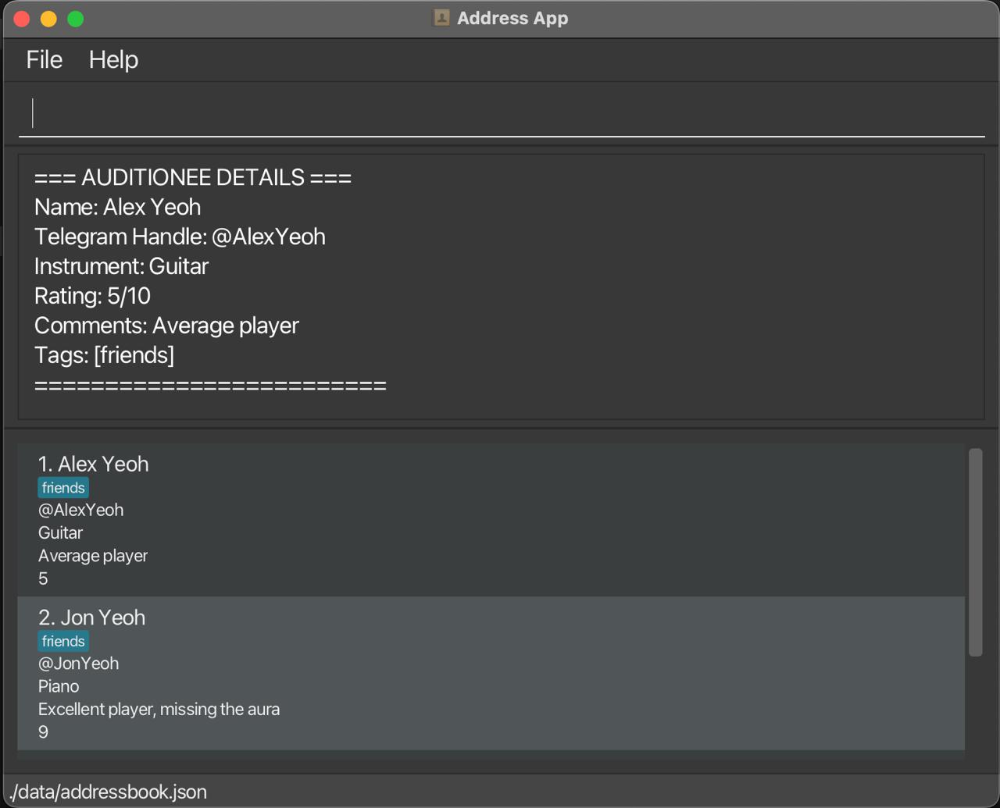

# AuditionNUS 🎶

This project is based on the AddressBook-Level3 project created by the [SE-EDU initiative](https://se-education.org).

## 📖 Overview
AuditionNUS is a desktop application designed to help NUS music groups conveniently manage auditionees.
It acts like an address book, storing key details of each auditionee such as:
* Name
* Instrument played
* Audition performance rating
* Comments from panelists
* Contact details (Telegram handle)

With this app, audition organizers can easily keep track of auditionees, update records, and retrieve information quickly during the audition process.

## 🚀 Features
* **View all auditionees**: List all auditionees currently stored in the app.
* **Add new auditionee**: Add a new entry with details like name, instrument, rating, comments, and contact.
* **Copy auditionee details**: Copy details of auditionees to clipboard.
* **Delete auditionee**: Remove an auditionee’s record when it’s no longer needed.
* **Sort auditionees**: Sort the list of auditionees (e.g. by name, rating, or instrument) for easier navigation.
* **View auditionee information**: Display the full details of a selected auditionee in a clear and structured format.
* **Edit auditionee details**: Update existing records to reflect new information or corrections.
* **Find auditionees**: Search for auditionees by name or instrument to quickly locate specific
* **Help command**: Access a list of available commands and their usage instructions.
