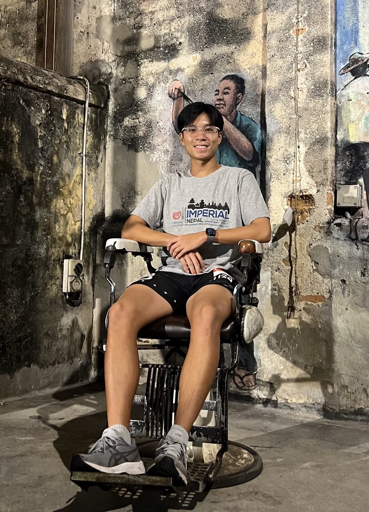
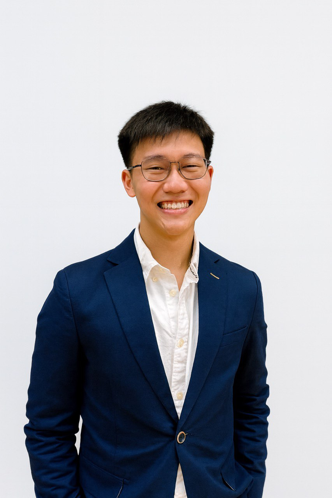
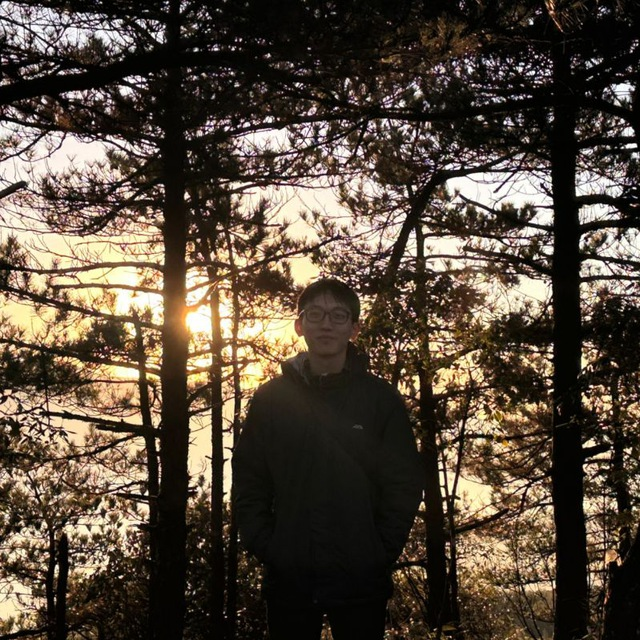
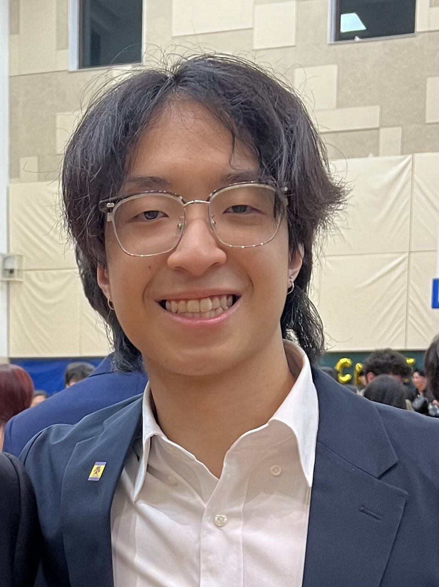

We are a team based in the [School of Computing, National University of Singapore](https://www.comp.nus.edu.sg).

You can reach us at the email `seer[at]comp.nus.edu.sg`

## Project team

### Tze Hsien

[[linkedIn](https://www.linkedin.com/in/tzehsien/)]
[[github](https://github.com/tzhsien)]
[[portfolio](team/tzehsien.md)]

### Jove Fong

[[homepage](https://www.linkedin.com/in/jovefong/)]
[[github](https://github.com/jovefyl)]
[[portfolio](team/johndoe.md)]

* Role: Developer
* Responsibilities: Implement viewAllAuditionees feature

### Zheng Jiongjie

[[github](http://github.com/zheng-jj)]
[[portfolio](https://zhengjiongjie.com)]

* Role: Developer
* Responsibilities: Implementation of adding new auditionees

### Johnny Doe

[[github](http://github.com/johndoe)] [[portfolio](team/johndoe.md)]

* Role: Developer
* Responsibilities: Data

### Jean Doe

[[github](http://github.com/johndoe)]
[[portfolio](team/johndoe.md)]

* Role: Developer
* Responsibilities: Dev Ops + Threading

### James Doe

[[github](http://github.com/johndoe)]
[[portfolio](team/johndoe.md)]

* Role: Developer
* Responsibilities: UI

### Hinlokk

[[github](http://github.com/Hinlokk)]
[[portfolio](team/Hinlokk.md)]

* Role: Developer
* Responsibilities: UI
