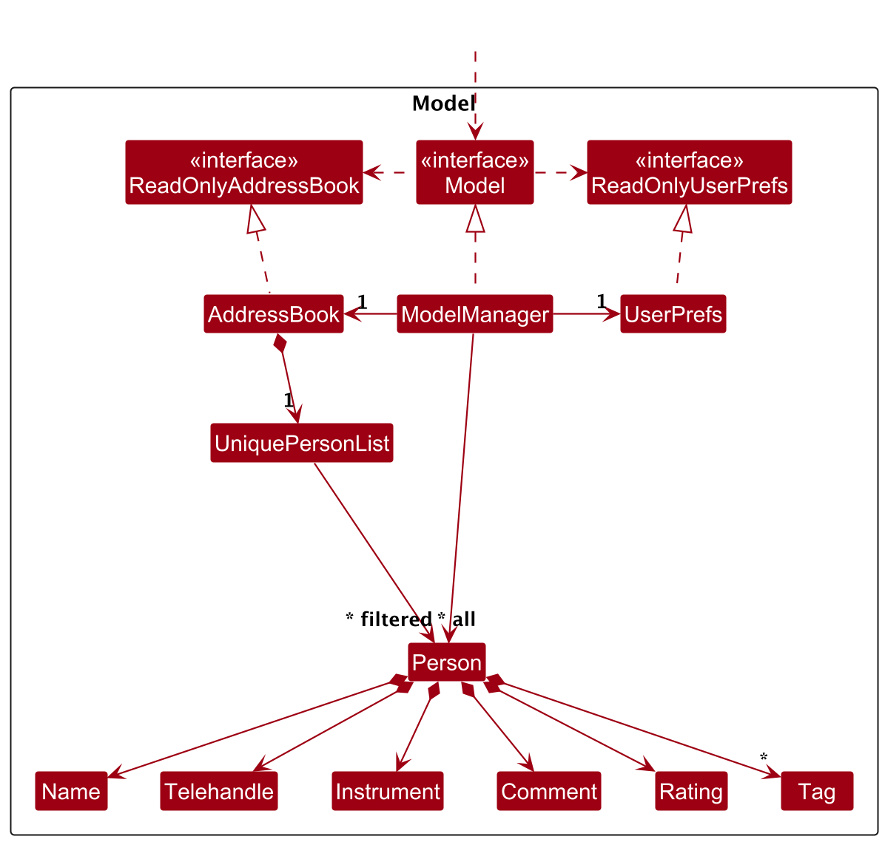
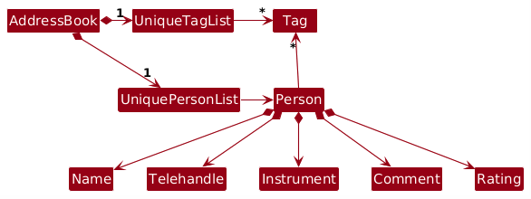
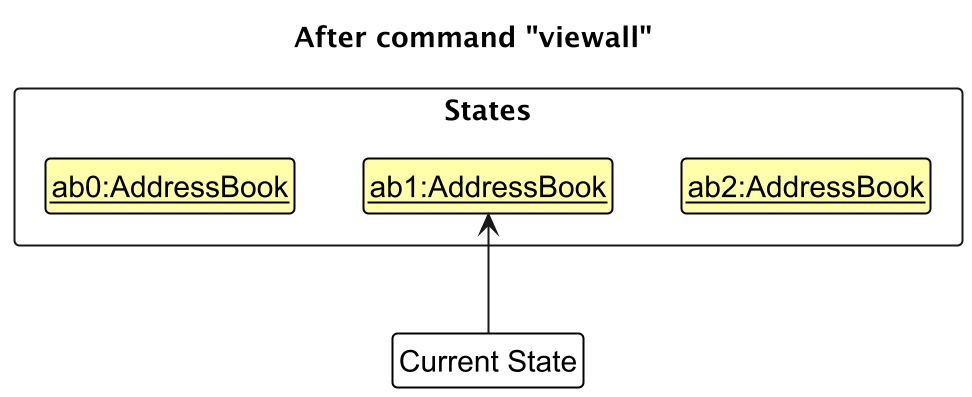

* Table of Contents
  {:toc}

--------------------------------------------------------------------------------------------------------------------

## **Acknowledgements**

* {list here sources of all reused/adapted ideas, code, documentation, and third-party libraries -- include links to the
  original source as well}

--------------------------------------------------------------------------------------------------------------------

## **Setting up, getting started**

Refer to the guide [_Setting up and getting started_](SettingUp.md).

--------------------------------------------------------------------------------------------------------------------

## **Design**

:bulb: **Tip:** The `.puml` files used to create diagrams are in this document `docs/diagrams` folder. Refer to the [
_PlantUML Tutorial_ at se-edu/guides](https://se-education.org/guides/tutorials/plantUml.html) to learn how to create
and edit diagrams.

### Architecture

The ***Architecture Diagram*** given above explains the high-level design of the App.

Given below is a quick overview of main components and how they interact with each other.

**Main components of the architecture**

**`Main`** (consisting of classes [
`Main`](https://github.com/se-edu/addressbook-level3/tree/master/src/main/java/seedu/address/Main.java) and [
`MainApp`](https://github.com/se-edu/addressbook-level3/tree/master/src/main/java/seedu/address/MainApp.java)) is in
charge of the app launch and shut down.

* At app launch, it initializes the other components in the correct sequence, and connects them up with each other.
* At shut down, it shuts down the other components and invokes cleanup methods where necessary.

The bulk of the app's work is done by the following four components:

* [**`UI`**](#ui-component): The UI of the App.
* [**`Logic`**](#logic-component): The command executor.
* [**`Model`**](#model-component): Holds the data of the App in memory.
* [**`Storage`**](#storage-component): Reads data from, and writes data to, the hard disk.

[**`Commons`**](#common-classes) represents a collection of classes used by multiple other components.

**How the architecture components interact with each other**

The *Sequence Diagram* below shows how the components interact with each other for the scenario where the user issues
the command `delete 1`.

Each of the four main components (also shown in the diagram above),

* defines its *API* in an `interface` with the same name as the Component.
* implements its functionality using a concrete `{Component Name}Manager` class (which follows the corresponding API
  `interface` mentioned in the previous point.

For example, the `Logic` component defines its API in the `Logic.java` interface and implements its functionality using
the `LogicManager.java` class which follows the `Logic` interface. Other components interact with a given component
through its interface rather than the concrete class (reason: to prevent outside component's being coupled to the
implementation of a component), as illustrated in the (partial) class diagram below.

The sections below give more details of each component.

### UI component

The **API** of this component is specified in [
`Ui.java`](https://github.com/se-edu/addressbook-level3/tree/master/src/main/java/seedu/address/ui/Ui.java)

The UI consists of a `MainWindow` that is made up of parts e.g.`CommandBox`, `ResultDisplay`, `PersonListPanel`,
`StatusBarFooter` etc. All these, including the `MainWindow`, inherit from the abstract `UiPart` class which captures
the commonalities between classes that represent parts of the visible GUI.

The `UI` component uses the JavaFx UI framework. The layout of these UI parts are defined in matching `.fxml` files that
are in the `src/main/resources/view` folder. For example, the layout of the [
`MainWindow`](https://github.com/se-edu/addressbook-level3/tree/master/src/main/java/seedu/address/ui/MainWindow.java)
is specified in [
`MainWindow.fxml`](https://github.com/se-edu/addressbook-level3/tree/master/src/main/resources/view/MainWindow.fxml)

The `UI` component,

* executes user commands using the `Logic` component.
* listens for changes to `Model` data so that the UI can be updated with the modified data.
* keeps a reference to the `Logic` component, because the `UI` relies on the `Logic` to execute commands.
* depends on some classes in the `Model` component, as it displays `Person` object residing in the `Model`.

### Logic component

**API** : [
`Logic.java`](https://github.com/se-edu/addressbook-level3/tree/master/src/main/java/seedu/address/logic/Logic.java)

Here's a (partial) class diagram of the `Logic` component:

The sequence diagram below illustrates the interactions within the `Logic` component, taking `execute("delete 1")` API
call as an example.

:information_source: **Note:** The lifeline for `DeleteCommandParser` should end at the destroy marker (X) but due to a limitation of PlantUML, the lifeline continues till the end of diagram.

How the `Logic` component works:

1. When `Logic` is called upon to execute a command, it is passed to an `AddressBookParser` object which in turn creates
   a parser that matches the command (e.g., `DeleteCommandParser`) and uses it to parse the command.
1. This results in a `Command` object (more precisely, an object of one of its subclasses e.g., `DeleteCommand`) which
   is executed by the `LogicManager`.
1. The command can communicate with the `Model` when it is executed (e.g. to delete a person). 
   Note that although this is shown as a single step in the diagram above (for simplicity), in the code it can take
   several interactions (between the command object and the `Model`) to achieve.
1. The result of the command execution is encapsulated as a `CommandResult` object which is returned back from `Logic`.

Here are the other classes in `Logic` (omitted from the class diagram above) that are used for parsing a user command:

How the parsing works:

* When called upon to parse a user command, the `AddressBookParser` class creates an `XYZCommandParser` (`XYZ` is a
  placeholder for the specific command name e.g., `AddCommandParser`) which uses the other classes shown above to parse
  the user command and create a `XYZCommand` object (e.g., `AddCommand`) which the `AddressBookParser` returns back as a
  `Command` object.
* All `XYZCommandParser` classes (e.g., `AddCommandParser`, `DeleteCommandParser`, ...) inherit from the `Parser`
  interface so that they can be treated similarly where possible e.g, during testing.

### Model component

**API** : [
`Model.java`](https://github.com/se-edu/addressbook-level3/tree/master/src/main/java/seedu/address/model/Model.java)

The `Model` component,

* stores the address book data i.e., all `Person` objects (which are contained in a `UniquePersonList` object).
* stores the currently 'selected' `Person` objects (e.g., results of a search query) as a separate _filtered_ list which
  is exposed to outsiders as an unmodifiable `ObservableList<Person>` that can be 'observed' e.g. the UI can be bound to
  this list so that the UI automatically updates when the data in the list change.
* stores a `UserPref` object that represents the user’s preferences. This is exposed to the outside as a
  `ReadOnlyUserPref` objects.
* does not depend on any of the other three components (as the `Model` represents data entities of the domain, they
  should make sense on their own without depending on other components)

:information_source: **Note:** An alternative (arguably, a more OOP) model is given below. It has a `Tag` list in the `AddressBook`, which `Person` references. This allows `AddressBook` to only require one `Tag` object per unique tag, instead of each `Person` needing their own `Tag` objects. 

### Storage component

**API** : [
`Storage.java`](https://github.com/se-edu/addressbook-level3/tree/master/src/main/java/seedu/address/storage/Storage.java)

The `Storage` component,

* can save both address book data and user preference data in JSON format, and read them back into corresponding
  objects.
* inherits from both `AddressBookStorage` and `UserPrefStorage`, which means it can be treated as either one (if only
  the functionality of only one is needed).
* depends on some classes in the `Model` component (because the `Storage` component's job is to save/retrieve objects
  that belong to the `Model`)

### Common classes

Classes used by multiple components are in the `seedu.address.commons` package.

--------------------------------------------------------------------------------------------------------------------

## **Implementation**

This section describes some noteworthy details on how certain features are implemented.

### Delete feature

The delete feature removes an auditionee identified by their index in the filtered list and restores the full list afterwards.
The command carries out strict validations to protect against inconsistent state:

1. `DeleteCommandParser` ensures the user provides a single positive index and surfaces parsing errors immediately.
2. `DeleteCommand` retrieves the filtered list, checks that the chosen index is within bounds, and asserts that the
   selected auditionee exists in the model before and after the deletion.
3. The filtered list is reset to show all auditionees before `model.deletePerson(...)` executes so the UI reflects the
   latest dataset.
4. `LogicManager` persists the updated address book to storage when the command completes successfully.

The full sequence is captured in `docs/diagrams/DeleteFeature.puml`.

### Edit feature

The edit feature lets users update one or more fields of an auditionee, with duplicate protection and comprehensive
validation of user input:

1. `EditCommandParser` tokenises the arguments, rejects repeated prefixes, and creates an `EditPersonDescriptor` only if
   at least one field is supplied.
2. During execution, `EditCommand` fetches the current filtered list, validates the index, and constructs the edited
   auditionee by merging existing and updated fields.
3. Any attempt to edit an auditionee into a duplicate (same name and instrument) triggers a `CommandException` before the
   model is mutated.
4. Once the `Model` is updated, the filtered list is reset and the success message is generated using the formatted
   auditionee details. The command result is then persisted by `LogicManager`.

See `docs/diagrams/EditFeature.puml` for the full sequence diagram.

### Find feature

The find feature filters auditionees by checking each keyword against multiple fields—name, Telegram handle, instrument,
rating, and tags. It emphasises safe execution through assertions that guarantee a consistent filtered list:

1. `FindCommandParser` splits the arguments on whitespace to build a `NameContainsKeywordsPredicate` covering all
   keywords.
2. `FindCommand` asserts that a predicate is always present, applies it to the model, and verifies that every auditionee
   in the filtered list satisfies the predicate.
3. The command returns a summary message showing how many auditionees matched the query.

Refer to `docs/diagrams/FindFeature.puml` for the detailed sequence diagram.

### Copy feature
Copies auditionee details to the system clipboard in a formatted table. You can optionally filter by instrument and
limit to top performers by rating.
The copy feature copies auditionee details, allowing for 2 parameters, `b/COUNT` and `i/INSTRUMENT` for the top `COUNT` auditionees playing `INSTRUMENT`. 

1. `CopyCommandParser` splits the arguments on whitespace.
2. `CopyCommand` filters the list of auditionees, generates the string, and copies it to device clipboard.
3. The command returns a summary message showing how many auditionees has been copied.

### \[Proposed\] Undo/redo feature

#### Proposed Implementation

The proposed undo/redo mechanism is facilitated by `VersionedAddressBook`. It extends `AddressBook` with an undo/redo
history, stored internally as an `addressBookStateList` and `currentStatePointer`. Additionally, it implements the
following operations:

* `VersionedAddressBook#commit()`— Saves the current address book state in its history.
* `VersionedAddressBook#undo()`— Restores the previous address book state from its history.
* `VersionedAddressBook#redo()`— Restores a previously undone address book state from its history.

These operations are exposed in the `Model` interface as `Model#commitAddressBook()`, `Model#undoAddressBook()` and
`Model#redoAddressBook()` respectively.

Given below is an example usage scenario and how the undo/redo mechanism behaves at each step.

Step 1. The user launches the application for the first time. The `VersionedAddressBook` will be initialized with the
initial address book state, and the `currentStatePointer` pointing to that single address book state.

Step 2. The user executes `delete 5` command to delete the 5th person in the address book. The `delete` command calls
`Model#commitAddressBook()`, causing the modified state of the address book after the `delete 5` command executes to be
saved in the `addressBookStateList`, and the `currentStatePointer` is shifted to the newly inserted address book state.

Step 3. The user executes `add n/David …​` to add a new person. The `add` command also calls
`Model#commitAddressBook()`, causing another modified address book state to be saved into the `addressBookStateList`.

:information_source: **Note:** If a command fails its execution, it will not call `Model#commitAddressBook()`, so the address book state will not be saved into the `addressBookStateList`.

Step 4. The user now decides that adding the person was a mistake, and decides to undo that action by executing the
`undo` command. The `undo` command will call `Model#undoAddressBook()`, which will shift the `currentStatePointer` once
to the left, pointing it to the previous address book state, and restores the address book to that state.

:information_source: **Note:** If the `currentStatePointer` is at index 0, pointing to the initial AddressBook state, then there are no previous AddressBook states to restore. The `undo` command uses `Model#canUndoAddressBook()` to check if this is the case. If so, it will return an error to the user rather
than attempting to perform the undo.

The following sequence diagram shows how an undo operation goes through the `Logic` component:

:information_source: **Note:** The lifeline for `UndoCommand` should end at the destroy marker (X) but due to a limitation of PlantUML, the lifeline reaches the end of diagram.

Similarly, how an undo operation goes through the `Model` component is shown below:

The `redo` command does the opposite — it calls `Model#redoAddressBook()`, which shifts the `currentStatePointer` once
to the right, pointing to the previously undone state, and restores the address book to that state.

:information_source: **Note:** If the `currentStatePointer` is at index `addressBookStateList.size() - 1`, pointing to the latest address book state, then there are no undone AddressBook states to restore. The `redo` command uses `Model#canRedoAddressBook()` to check if this is the case. If so, it will return an error to the user rather than attempting to perform the redo.

Step 5. The user then decides to execute the command `list`. Commands that do not modify the address book, such as
`list`, will usually not call `Model#commitAddressBook()`, `Model#undoAddressBook()` or `Model#redoAddressBook()`. Thus,
the `addressBookStateList` remains unchanged.

Step 6. The user executes `clear`, which calls `Model#commitAddressBook()`. Since the `currentStatePointer` is not
pointing at the end of the `addressBookStateList`, all address book states after the `currentStatePointer` will be
purged. Reason: It no longer makes sense to redo the `add n/David …​` command. This is the behavior that most modern
desktop applications follow.

The following activity diagram summarizes what happens when a user executes a new command:

#### Design considerations:

**Aspect: How undo & redo executes:**

* **Alternative 1 (current choice):** Saves the entire address book.
    * Pros: Easy to implement.
    * Cons: May have performance issues in terms of memory usage.

* **Alternative 2:** Individual command knows how to undo/redo by
  itself.
    * Pros: Will use less memory (e.g. for `delete`, just save the person being deleted).
    * Cons: We must ensure that the implementation of each individual command are correct.

--------------------------------------------------------------------------------------------------------------------

## **Documentation, logging, testing, configuration, dev-ops**

* [Documentation guide](Documentation.md)
* [Testing guide](Testing.md)
* [Logging guide](Logging.md)
* [Configuration guide](Configuration.md)
* [DevOps guide](DevOps.md)

--------------------------------------------------------------------------------------------------------------------

## **Appendix: Requirements**

### Product scope

**Target user profile**:

* has a need to manage a significant number of auditionees for NUS Music Club
* has a need to review auditionees quickly
* prefer desktop apps over other types
* can type fast
* prefers typing to mouse interactions
* is reasonably comfortable using CLI apps

**Value proposition**: manage auditionees faster than a typical mouse/GUI driven app

### User stories

Priorities: High (must have) - `* * *`, Medium (nice to have) - `* *`, Low (unlikely to have) - `*`

| Priority | As a …​                                    | I want to …​                     | So that I can…​                                                        |
| -------- | ------------------------------------------ | ------------------------------ | ---------------------------------------------------------------------- |
| `* * *`  | new user                                   | see usage instructions         | refer to instructions when I forget how to use the App                 |
| `* * *`  | user                                       | add a new person               |                                                                        |
| `* * *`  | user                                       | delete a person                | remove entries that I no longer need                                   |
| `* * *`  | user                                       | find a person by name or tag   | locate details of persons without having to go through the entire list |
| `* *`    | user                                       | hide private contact details   | minimize chance of someone else seeing them by accident                |
| `*`      | user with many persons in the address book | sort persons by name           | locate a person easily                                                 |
| `* * *`  | club leader   | view all auditionees with indices           | identify the correct record to edit or delete     |
| `* * *`  | club leader   | delete an auditionee by index               | remove incorrect or outdated entries              |
| `* * *`  | club leader   | add a new auditionee                        | keep the audition list up to date                 |
| `* * *`  | club leader   | find auditionees by name, instrument, handle, or rating | locate a record without scanning the full list    |
| `* *`    | club leader   | edit an auditionee’s details                | correct mistakes without re-adding the entry      |
| `* *`    | club leader   | filter auditionees by instrument/timeslot   | shortlist candidates efficiently                  |
| `*`      | club leader   | undo the last delete                        | recover from accidental deletions                 |
| `*`      | club leader   | see a confirmation/prompt for destructive ops| avoid accidental data loss                        |
| `* *`    | club leader   | see error messages for invalid indices      | understand how to correct my command              |
| `* *`    | club leader   | export auditionees                          | share lists with the team                         |
| `* *`    | club leader   | copy auditionee details to clipboard        | publish the results of the audition                |

### Use cases

(For all use cases below, the **System** is the `AuditionNUS` and the **Actor** is the `user`, unless specified
otherwise)

Use case 1: UC01 – View all auditionees.
Actors: User (audition organizer)
Goal: View all auditionees with their details (name, instrument, rating, comments, contact details (Telegram Handle),
etc.)

**MSS**

1.  User requests to <u>view all auditionees (UC01)</u>.
2.  AddressBook shows a list of auditionees with their details.
    Use case ends.

Use case 2: UC02 – Sort all auditionees.
Actors: User (audition organizer)
Goal: Sort and display all auditionees with their details according to rating.

**MSS**

1.  Leader requests to sort the auditionees.
2.  AuditionNUS retrieves the list of auditionees.
3.  AuditionNUS sorts the list.
4.  AuditionNUS displays the sorted list of auditionees.
    Use case ends.

**Extensions**

- 3a. No auditionees found in the system.
  - 3a1. AuditionNUS shows “No auditionees available to sort.” Use case ends.

Use case 3: UC03 – Add new auditionee.
Actors: User (audition organizer)
Goal: Add the details for new auditionees.

**MSS**

1.  User requests to add new auditionee.
2.  User enters auditionee details.
3.  System saves the details of new auditionee.
4.  System displays success message, as well as the details of added auditonee.
    Use case ends.

**Extensions**

2a. System detects error in entered data.
  - 2a1. System requests for the correct data.
  - 2a2. User enters new data.
  - Steps 2a1-2a2 are repeated until the data entered are correct.
  - Use case resumes from step 3.

*a. At any time, User chooses to cancel the addition of new auditionee.
   - Use case ends.

**Use case: Delete an auditionee**

- **Actor**: Club leader
- **Goal**: Remove an auditionee’s record from the system
- **Precondition**: Auditionee list is not empty

**MSS**

1. User requests to list auditionees (e.g., `viewAll`).
2. System shows the list with indices.
3. User enters `delete INDEX`, e.g., `delete 2`.
4. System validates the index.
5. System deletes the corresponding auditionee.
6. System shows: `Deleted Person: john; TeleHandle: @johnboy; Instrument: guitar; Rating: 9; Comment: very good; Tags: [friends]`

**Extensions**

* 2a. The list is empty.
  → Use case ends.

* 3a. INDEX is not a positive integer starting from 1 (for example `delete 0` or `delete a`).
  3a1. System shows: `Index must be a positive integer starting from 1. 
  3a2. Use case resumes at step 3.

* 3b. More than one index is provided (for example `delete 1 2`).
  3b1. System shows: `Only one index can be provided to the delete command.`
  3b2. Use case resumes at step 3.

* 3c. INDEX is out of the displayed range.
  3c1. System shows: `The auditionee index provided is out of range of the displayed list; enter a value between 1 and the number of shown auditionees.`
  3c2. Use case resumes at step 3.

**Command format and validation (for reference)**

* Command: `delete INDEX`
* Acceptable values: `INDEX` is an integer corresponding to the currently displayed list.
* Error messages:
    * `Index must be a positive integer starting from 1.` when the input is empty, 0, negative, or contains non-numeric text
    * `Only one index can be provided to the delete command.` when multiple indices are supplied
    * `The auditionee index provided is out of range of the displayed list; enter a value between 1 and the number of shown auditionees.` when the index does not exist in the system
* Rationale: Using the displayed index avoids confusion across potential duplicate names.

### Non-Functional Requirements

1.  Should work on any _mainstream OS_ as long as it has Java `17` or above installed.
2.  Should be able to hold up to 1000 persons without a noticeable sluggishness in performance for typical usage.
3.  A user with above average typing speed for regular English text (i.e. not code, not system admin commands) should be able to accomplish most of the tasks faster using commands than using the mouse.
4.  Data mutations (add/edit/delete) are atomic; no partial writes.
5.  Optional command history enables tracing changes.
6.  App must not crash when main operations are conducted.
7.  App should start up in less than **2 seconds**.

### Glossary

* **Mainstream OS**: Windows, Linux, Unix, MacOS
* **Private contact detail**: A contact detail that is not meant to be shared with others
* **Auditionee**: A person registered to audition for the NUS Music Club.
* **Index**: A 1-based integer referencing an item in the currently displayed list.
* **Record**: The stored data of an auditionee (e.g., name, instrument, timeslot).
* **Validation**: Checking that user input (e.g., index) is syntactically and semantically acceptable.
* **Instrument**: Musical instrument auditioned for
* **Rating**: Numerical score, expected range 0–10
* **Telegram handle**: Communication identifier, prefixed with @
* **Copy**: Command that copies auditionee data, optionally filtered by instrument/rating
* **Index**: 1-based integer referencing the currently displayed list

--------------------------------------------------------------------------------------------------------------------

## Future Improvements

- Improve readability of error messages by implementing vertical scroll instead of letting text overflow horizontally
- Allow for more customization when it comes to copying
- Allow for find feature to search by partial names instead of full name
- Better handling of extra spaces in name input

--------------------------------------------------------------------------------------------------------------------

## **Appendix: Instructions for manual testing**

Given below are instructions to test the app manually.

**Note:** These instructions only provide a starting point for testers to work on;
testers are expected to do more *exploratory* testing.

 Action       | Format, Examples
--------------|-----------------------------------------------------------------------------------------------------------------------------------------------------------------
 **Add**      | `add n/NAME h/TELEHANDLE i/INSTRUMENT c/COMMENT r/RATING [t/TAG]...`   e.g., `add n/John Doe h/@JOHNDOE i/Guitar c/Very good guitarist r/9 t/friends t/band`
 **Copy**     | `copy [b/COUNT] [i/INSTRUMENT]`  e.g., `copy b/5`, `copy i/Piano`, `copy b/3 i/Guitar`
 **Delete**   | `delete INDEX`  e.g., `delete 3`
 **Edit**     | `edit INDEX [n/NAME] [h/TELEHANDLE] [i/INSTRUMENT] [c/COMMENT] [r/RATING] [t/TAG]...`  e.g.,`edit 1 h/@JohnDoe i/Piano`
 **Exit**     | `exit`
 **Find**     | `find KEYWORD [MORE_KEYWORDS]`  e.g., `find James Jake`
 **Help**     | `help`
 **Sort**     | `sort`
 **View**     | `view INDEX`   e.g., `view 3`
 **View All** | `viewall`
