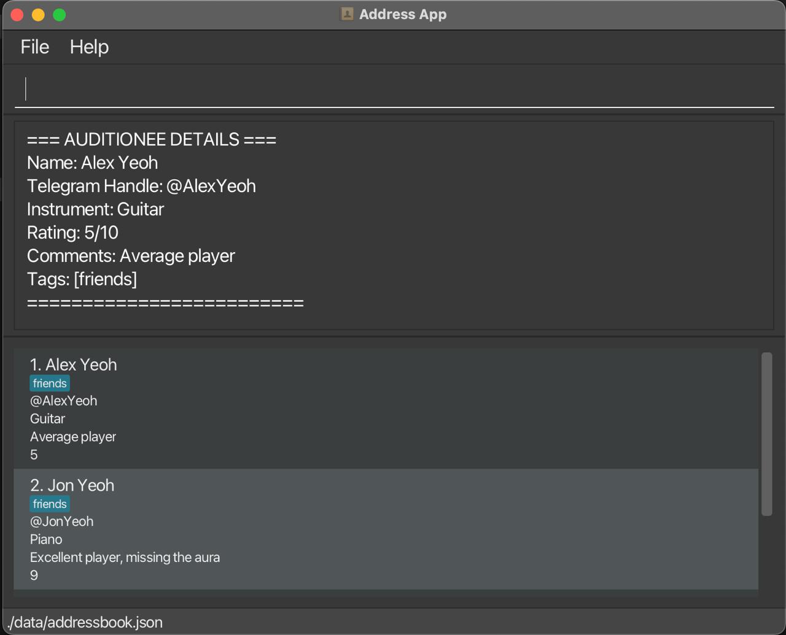
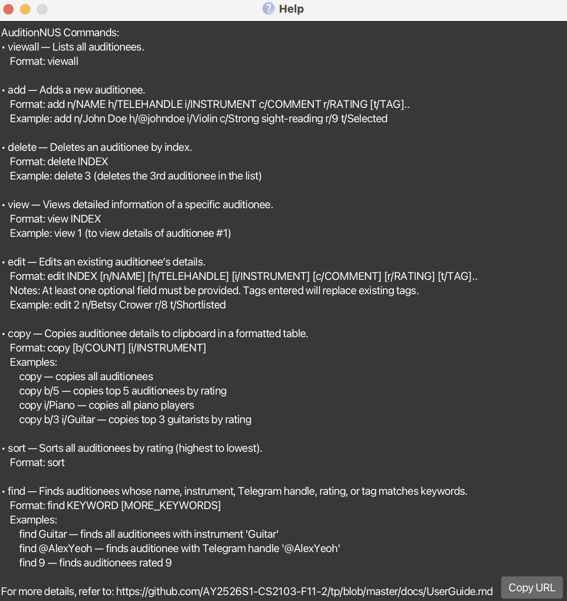
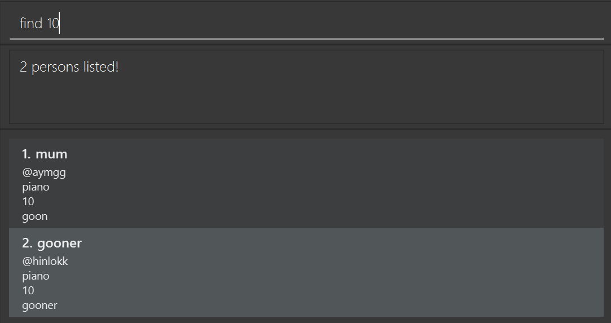

AuditionNUS is a **desktop app for managing auditionee information, optimized for use via a Command Line Interface**
(CLI) while still having the benefits of a Graphical User Interface (GUI). If you can type fast, AuditionNUS can get
your auditionee management tasks done faster than traditional GUI apps.

# Table of Contents

- [Quick Start](#quick-start)
- [Features](#features)
    - [Viewing Help: `help`](#viewing-help--help)
    - [Adding an Auditionee: `add`](#adding-a-person-add)
    - [Listing All Auditionees: `viewall`](#listing-all-persons--viewall)
    - [Editing an Auditionee: `edit`](#editing-a-person--edit)
    - [Finding Auditionees: `find`](#locating-persons-by-tag-or-name-find)
    - [Copying Auditionee Details: `copy`](#copying-auditionee-details-copy)
    - [Deleting an Auditionee: `delete`](#deleting-a-person--delete)
    - [Sorting Auditionees by Rating: `sort`](#sorting-all-persons-by-rating--sort)
    - [Exiting the Program: `exit`](#exiting-the-program--exit)
    - [Saving the Data](#saving-the-data)
    - [Editing the Data File](#editing-the-data-file)
    - [Archiving Data Files `[coming in v2.0]`](#archiving-data-files-coming-in-v20)
- [FAQ](#faq)
- [Command Summary](#command-summary)

---

## Quick start

1. Ensure you have Java `17` or above installed in your Computer. 
   **Mac users:** Ensure you have the precise JDK version
   prescribed [here](https://se-education.org/guides/tutorials/javaInstallationMac.html).

1. Download the latest `.jar` file from [here](https://github.com/AY2526S1-CS2103-F11-2/tp/releases).

1. Copy the file to the folder you want to use as the _home folder_ for your AuditionNUS.

1. Open a command terminal, `cd` into the folder you put the jar file in, and use the `java -jar AuditionNUS.jar`
   command to run the application. 
   A GUI similar to the below should appear in a few seconds. Note how the app contains some sample data. 
   

1. Type the command in the command box and press Enter to execute it. e.g. typing **`help`** and pressing Enter will
   open the help window. 
   Some example commands you can try:

    - `viewall` : Lists all auditionees.

    - `add n/<name> h/<telegramhandle> i/<instrument> c/<comments> r/<final score out of 10> ` : Adds an auditionee
      to the AuditionBook.

    - `delete 3` : Deletes the 3rd contact shown in the current list.

    - `clear` : Deletes all contacts.

    - `exit` : Exits the app.

1. Refer to the [Features](#features) below for details of each command.

---

## Features

**Notes about the command format:** 

- Words in `UPPER_CASE` are the parameters to be supplied by the user. 
  e.g. in `add n/NAME`, `NAME` is a parameter which can be used as `add n/John Doe`.

- Items in square brackets are optional. 
  e.g `n/NAME [t/TAG]` can be used as `n/John Doe t/friend` or as `n/John Doe`.

- Items with `…`​ after them can be used multiple times including zero times. 
  e.g. `[t/TAG]…​` can be used as ` ` (i.e. 0 times), `t/friend`, `t/friend t/family` etc.

- Parameters can be in any order. 
  e.g. if the command specifies `n/NAME p/PHONE_NUMBER`, `p/PHONE_NUMBER n/NAME` is also acceptable.

- Extraneous parameters for commands that do not take in parameters (such as `help`, `list`, `exit` and `clear`) will be
  ignored. 
  e.g. if the command specifies `help 123`, it will be interpreted as `help`.

- If you are using a PDF version of this document, be careful when copying and pasting commands that span multiple lines
  as space characters surrounding line-breaks may be omitted when copied over to the application.

### Viewing help : `help`

Shows a message explaining how to access the help page.

Format: `help`

### Adding a person: `add`

Adds a auditionee to the AuditionNUS.

Format: `add n/NAME t/TELEHANDLE i/INSTRUMENT c/COMMENT r/RATING [t/TAG]…​`

**Tip:** A person can have any number of tags (including 0)

e.g., `add n/John Doe h/@JOHNDOE i/Guitar c/Very good guitarist r/9 t/friends t/band`

### Listing all persons : `viewall`

Shows a list of all persons recorded in AuditionNUS.

Format: `viewall`

### Editing a person : `edit`

Edits the record of an existing person in AuditionNUS.

Format: `edit INDEX [n/NAME] [h/TELEHANDLE] [i/INSTRUMENT] [c/COMMENT] [r/RATING] [t/TAG]...​`

- Edits the person at the specified `INDEX`. The index refers to the index number shown in the displayed person list.
  The index **must be a positive integer** 1, 2, 3, …​
- At least one of the optional fields must be provided.
- Existing values will be updated to the input values.
- When editing tags, the existing tags of the person will be removed i.e adding of tags is not cumulative.
- You can remove all the person’s tags by typing `t/` without
  specifying any tags after it.

e.g., `edit 1 h/@JohnDoe i/Piano`

### Locating auditionees by tag or name: `find`

Finds auditionees whose names, instruments, Telegram handles, ratings, or tags contain any of the given keywords.

Format: `find KEYWORD [MORE_KEYWORDS]`

- The order of the keywords does not matter. e.g. `@alice Guitar` will match `Guitar @alice`
- Only full words will be matched e.g. `Guit` will not match `Guitar`
- Persons matching at least one keyword will be returned (i.e. `OR` search).
  `Guitar @alice` will return every auditionee who either plays the guitar or has the Telegram handle `@alice`

Examples:

- `find Guitar` returns all auditionees whose instrument tag is `Guitar`
- `find @AlexYeoh` returns the auditionee with the Telegram handle `@AlexYeoh`
- `find 9` returns auditionees rated `9`
- `find John` still returns `john` and `John Doe`
  

### Copying auditionee details: `copy`

Copies auditionee details to the system clipboard in a formatted table. You can optionally filter by instrument and
limit to top performers by rating.

Format: `copy [b/COUNT] [i/INSTRUMENT]`

- Copies auditionee information to clipboard for easy sharing or documentation
- Without parameters, copies all auditionees in the current list
- `b/COUNT` limits output to top COUNT auditionees sorted by rating (highest to lowest)
- `i/INSTRUMENT` filters to show only auditionees who play the specified instrument
- Parameters can be combined to get top N performers of a specific instrument
- The output is formatted as a table with columns for name, telehandle, instrument, rating, comment, and tags

Examples:

* `find Guitar` returns all auditionees who play the guitar.
* `find @AlexYeoh` returns the auditionee with the Telegram handle `@AlexYeoh`.
* `find 9` returns auditionees rated `9`.
* `find John` still returns `john` and `John Doe`.
   
- `copy` copies all auditionees to clipboard
- `copy b/5` copies the top 5 auditionees by rating
- `copy i/Piano` copies all piano players
- `copy b/5 i/Piano` copies the top 5 piano players by rating
- `copy b/3 i/Guitar` copies the top 3 guitarists by rating

### Deleting a auditionee : `delete`

Deletes the specified person from AuditionNUS.

Format: `delete INDEX`

- Deletes the person at the specified `INDEX`.
- The index refers to the index number shown in the displayed person list.
- The index **must be a positive integer** 1, 2, 3, …​

Examples:

* `list` followed by `delete 2` deletes the 2nd person in AuditionNUS.
* `find Betsy` followed by `delete 1` deletes the 1st person in the results of the `find` command.

### Sorting all persons by rating : `sort`

Sorts all persons by rating in AuditionNUS.

Format: `sort`

### Exiting the program : `exit`

Exits the program.

Format: `exit`

### Saving the data

AuditionNUS data are saved in the hard disk automatically after any command that changes the data. There is no need to
save manually.

### Editing the data file

AuditionNUS data are saved automatically as a JSON file `[JAR file location]/data/AuditionNUS.json`. Advanced users are
welcome to update data directly by editing that data file.

:exclamation: **Caution:**
If your changes to the data file makes its format invalid, AuditionNUS will discard all data and start with an empty data file at the next run. Hence, it is recommended to take a backup of the file before editing it. 
Furthermore, certain edits can cause the AuditionNUS to behave in unexpected ways (e.g., if a value entered is outside of the acceptable range). Therefore, edit the data file only if you are confident that you can update it correctly.

### Archiving data files `[coming in v2.0]`

_Details coming soon ..._

---

## FAQ

**Q**: How do I transfer my data to another Computer? 
**A**: Install the app in the other computer and overwrite the empty data file it creates with the file that contains
the data of your previous AuditionNUS home folder.

---

## Command summary

 Action       | Format, Examples
--------------|-----------------------------------------------------------------------------------------------------------------------------------------------------------------
 **Add**      | `add n/NAME h/TELEHANDLE i/INSTRUMENT c/COMMENT r/RATING [t/TAG]...`   e.g., `add n/John Doe h/@JOHNDOE i/Guitar c/Very good guitarist r/9 t/friends t/band`
 **Copy**     | `copy [b/COUNT] [i/INSTRUMENT]`  e.g., `copy b/5`, `copy i/Piano`, `copy b/3 i/Guitar`
 **Delete**   | `delete INDEX`  e.g., `delete 3`
 **Edit**     | `edit INDEX [n/NAME] [h/TELEHANDLE] [i/INSTRUMENT] [c/COMMENT] [r/RATING] [t/TAG]...`  e.g.,`edit 1 h/@JohnDoe i/Piano`
 **Exit**     | `exit`
 **Find**     | `find KEYWORD [MORE_KEYWORDS]`  e.g., `find James Jake`
 **Help**     | `help`
 **Sort**     | `sort`
 **View**     | `view INDEX`   e.g., `view 3`
 **View All** | `viewall`
